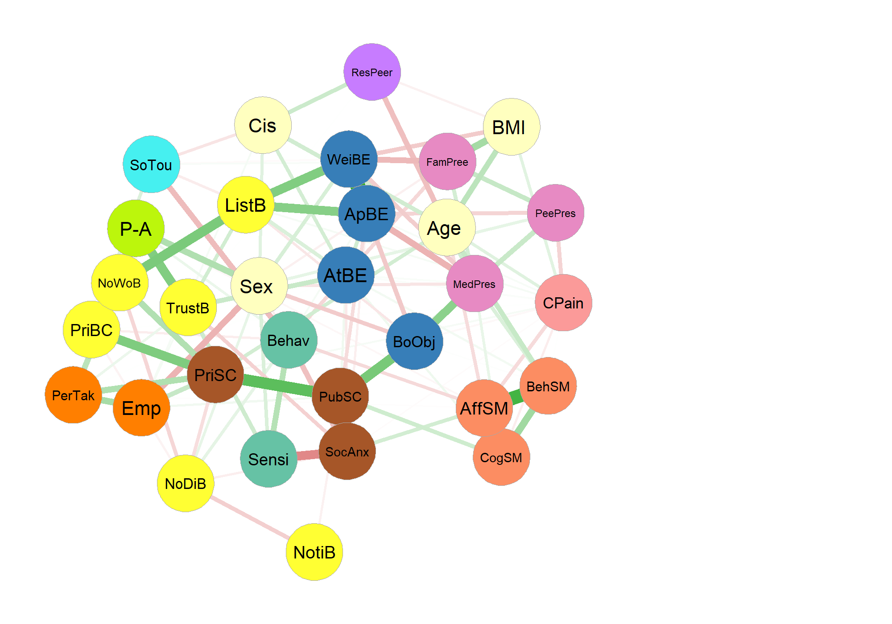

```{r setup, echo  = FALSE}

#https://bookdown.org/yihui/rmarkdown-cookbook/figure-placement.html

knitr::opts_chunk$set(fig.pos  = "H", out.extra  = ""
	#message  = FALSE,
	#warning  = FALSE
)

#renv::activate("../../R_Env_Quest")
library(knitr)
library(kableExtra) ##https://haozhu233.github.io/kableExtra/awesome_table_in_pdf.pdf


load("../NetworkAnalyseTOUT.RData")  # Charger le fichier .RData

```


# Introduction


-	Adams 2022 The role of interoception in the overlap between eating disorders and autism: Methodological considerations

-	Murphy 2017 Interoception and psychopathology: A developmental neuroscience perspective 


sex difference  : 

-	Murphy 2019 Does Atypical Interoception Following Physical Change Contribute to Sex Differences in Mental Illness?

-	 Prentice 2022b  Gender differences in interoceptive accuracy and emotional ability: An explanation for incompatible findings ==> "Here we extend Pennebaker and Roberts’ (1992) theory of gender
differences in the use of interoceptive signals for emotional experience, proposing that language socialisation
may result in gender differences in the propensity to label internal state changes as physiological or emotional,
respectively. Despite outstanding questions concerning the fractionation of interoceptive and emotional domains,
this theory provides a plausible explanation for seemingly incompatible findings of gender differences in
interoceptive and emotional abilities.

-	Prentice 2022 Sex differences in interoceptive accuracy: A meta-analysis


\newpage

# Material and methods

## Sample recruitment

We conducted a voluntary and anonymous online survey accessible on limesurvey between May 2021 and May 2023. Participants were informed that the aim of the study was to better understand "the links between body and mind during adolescence" through a video and an explanatory text presented in the first page of the questionnaire. We collaborated with schools and sports clubs in various regions of France, and launched a campaign through email, social media, and word of mouth, inviting individuals between the ages of 10 and 23 to participate. Ethical approval for the study was obtained from the University of Marseille.

## Measures

The whole survey was composed of general information, scales, and subscales previously validated, as well as two subscales constructed based on questions from validated scales (Social Touch and Movement Seeking). All scales that required answers on a Likert scale were converted to a 5-point scale to facilitate the completion of the survey. All questions were forced-choice (except for the Resistance to Peer Influence questionnaire), but participants had the option to answer "I do not wish to answer" or "I do not understand the question". They were also invited to leave any comments/remarks at the end of the questionnaire. To gather information about survey distribution, we collected data on how individuals enrolled in the study and postal codes. We also assessed dominant hand, native language, grade level in school, and, for university students, their major. In total, participants answered 171 items, from which we obtain 33 measures for analysis.

#### General information

Participants were asked to provide information about **Sex** and **Age** as well as gender, weight and height. **Body Mass Index** was calculated from weight/height ratio. Using the information on sex and gender, we derived a binary variable indicating whether the participant was **Cisgender** or not. To assess **Subjective Economic Status**, participants were asked to rate the economic status (income) of their family/environment during their upbringing on a 5 points scale ("Very difficult", "Difficult", "Neither difficult nor comfortable", "Comfortable", "Very comfortable"). Participants were asked to report the number of **Chronic pain** conditions they had.

#### Puberty

The Pubertal Development Scale (PDS) [@petersen_self-report_1988] contains 5 items assessing pubertal status, including, for both boys and girls, the presence of a growth spurt, pubic hair, and skin changes. For girls, 2 items also assess breast development and menarche and for boys, facial hair growth and voice change. There is a significant correlation between PDS and pubertal status estimate thought physical exam [@shirtcliff_pubertal_2009]. Each item ranges from 1 (development has not yet begun) to 4 (development seems completed). From the mean on the 5 scores, we obtained a continuous puberty index.

#### Physical activity

We used Saltin-Grimby Physical Activity Level Scale (SGPA) which is a four-level questionnaire to assess leisure time physical activity [@grimby_saltin-grimby_2015] and have recently been shown to be successfully to assess physical activity levels in adolescents [@beldo_criterion_2022]. We used the french version recently used by[@isoard-gautheur_relationships_2023].

#### Private and Public Self Consciousness Scale and Social Anxiety

We used the 22 items french version [@pelletier_lechelle_1990] of the revised version [@scheier_self-consciousness_1985] of the Self Consciousness Scale (SCS) [@fenigstein_public_1975]. The SCS consists of three subscales. The **Private Self-Consciousness subscale** (9 items) allow to assess the extent to which individuals focus on internal thought, sensations and feelings (e.g. ''I'm always trying to figure myself out''). The **Public Self-Consciousness subscale** (7 items) quantify to what extend individual tend to focusing on oneself as an object of an observer's (e.g.''I usually worry about making a good impression''). The **Social Anxiety subscale** (6 items), measures distress caused by interacting with others (e.g.''I have trouble working when someone is watching me''). 2 Items (6 and 8, Private Self-Consciousness) were rephrased to be more easily understandable by younger participants (as there is no validated version for children nor adolescents in French). 2 Items (16 and 20, Social Self Consciousness) were modified not to be oriented toward appearance. The Likert scale range from "extremely uncharacteristic of me" (1) to "extremely characteristic" (5) with higher values indicating higher tendency to focus on oneself / be anxious. Internal consistency across all items in the present study (before imputation for missing data) was $\alpha$ = `r alpha_Dcons`. (Private SCS $\alpha$ = `r alpha_Dpriv`, Public SCS $\alpha$ = `r alpha_Dpub`, Social Anxiety $\alpha$ = `r alpha_Danx`)

#### Perspective Taking and Empathic Concern

We used 2 subscales of the French version [@gilet_assessing_2013] of the Interpersonal Reactivity Index (IRI) [@davis_interpersonal_1980] used on adolescents [@hawk_examining_2013]. **Perspective Taking** (7 items) reflected a tendency or ability of the subject to adopt the perspective, or point of view, of other people (e.g., "I try to look at everybody's side of a disagreement before I make a decision") and is considered as a measure of cognitive empathy. **Empathic Concern** (7 items) concern the tendency to experience feelings of warmth, compassion and concern for others undergoing negative experiences (e.g., "When I see someone being taken advantage of, I feel kind of protective towards them.") and is considered as a measure of Affective Empathy. The Likert scale range from "this doesn't describe me at all" (1) to "this describes me very well" (5) with higher values showing higher empathy. Internal consistency across all items in the present study was $\alpha$ = `r alpha_EIRI`. (Perspective Taking $\alpha$ = `r alpha_EPT`, Empathic Concern $\alpha$ = `r alpha_EEC`)

#### Affective, behavioral and cognitive engagement in Social Media

We used the 11 itemsSocial Media Engagement Scale For Adolescents [@ni_development_2020]. The questionnaire looks at social media engagement through three subscales: **Behavioral engagement** (4 items) (e.g., "Using social media is my daily habit"), **Cognitive engagement** (3 items) (e.g., "The support and encouragement of others on social media is very important to me") and **Affective engagement** (4 items) (e.g., "I feel bored when I can't use social media"). The Likert scale range from "strongly disagree" (1) to "strongly agree" (5). We translate the questionnaire as no version actually exist in french and found good measure of Internal consistency in the whole scale ($\alpha$ = `r alpha_Greseau`) and in the 3 subscales (Behavioral $\alpha$ = `r alpha_Gcomp`, Cognitive $\alpha$ = `r alpha_Gcog`, Affective $\alpha$ = `r alpha_Gaffec`)

#### Body-Esteem for Appearence, for Weight and Attribution

We used the french version [@valls_etude_2011] of the 23 items Body-Esteem Scale validated for adolescents (@mendelson_body-esteem_2001]. The questionnaire consist of three subscales. The **Appearance** subscale (10 items) asses general feelings about one's looks (e.g., ''I like what I see when I look in the mirror''). The **Weight satisfaction** (8 tiems) investigates perceptions of one's own weight and to which extent one would like to change it (e.g.,''I am satisfied with my weight''). The **Attribution** subscale (5 items) deals with the participant's beliefs about how others perceive her looks (e.g.,''People like my looks''). The Likert scale range from "never" (1) to "always" (5) with higher scores indicating more positive feelings about appearance, greater weight satisfaction, and positive beliefs on how others perceive their bodies. Internal consistency across all items in the present study was $\alpha$ = `r alpha_Hest`. (Appearance $\alpha$ = `r alpha_Happa`, Weight $\alpha$ = `r alpha_Hwei`, Attribution $\alpha$ = `r alpha_Hattri`). 

#### Body Objectificiation

We used the french version [@wollast_how_2019] of the Body Surveillance subscale (8 items) of the Objectified Body Consciousness Scale (OBCS)[@mckinley_objectified_1996] which examine the degree to which individual takes an outsider's stance when viewing his/her body (e.g., "I am more concerned with what my body can do than how it looks"). The Likert scale range from "Strongly Disagree" (1) to "Strongly Agree" (5) with higher scores indicating strong tendency to body objectification. Internal consistency across all items in the present study was $\alpha$ = `r alpha_Iobj`.

#### Family, peers and social-media appearance-related pressures

We used the french version [@rodgers_psychometric_2016] of the 3 subscales focusing in the appearance-related pressures of the Sociocultural Attitudes Towards Appearance Questionnaire 4 (SATAQ-4) [@schaefer_development_2015]. These 4-items scales assess pressures originating from **Family** (4 items) (e.g., "I feel pressure from family members to improve my appearance"), **Peers** (4 items) (e.g.,"I feel pressure from my peers to look in better shape"), and **Social Media** (4 items) (e.g.,"I feel pressure from the media to look in better shape"). The Likert scale range from "definitely dis-agree" (1) to "definitely agree" (5), with higher scores indicating greater felt pressure. Following some report of misunderstanding in young sample in pre-test, we modified formulation of 4 items. Internal consistency across all items in the present study was $\alpha$ = `r alpha_IIpress`. (Family $\alpha$ = `r alpha_IIfam`, Peers $\alpha$ = `r alpha_IIpee`, Attribution $\alpha$ = `r alpha_IImed`).

#### Private body Consciousness.
We used the private body subscale (5 items) of the Body Consciousness Questinonaire [@miller_consciousness_1981] used in adolescents by @black_gender_2010. It adress sensitivity in perception of internal bodily sensations (e.g., "I am sensitive to internal bodily tensions'). The Likert scale range from"extremely uncharacteristic of me" (1) to "extremely characteristic of me" (5), with higher scores high sensitivity. Internal consistency across all items in the present study was $\alpha$ = `r alpha_Jcons`.

#### Body Noticing, not-distracting, not-worrying, litstening and trustring and emotional awareness of the body
We used 6 subscales of the french version of Multidimensional Assessment of Interoceptive Awareness (MAIA) [@mehling_multidimensional_2012] validated in youth [@jones_exploring_2021]. **Noticing** (4 items) concern the subjective awareness of body sensations (e.g., "I notice changes in my breathing, such as whether it speeds up or slows down"). **Not-Distracting** (3 items) investigates how often a person tends not to ignore sensations of pain or discomfort (e.g., "I distract myself from sensations of discomfort"). **Not-Worrying** (3 items) assess the extent to which a person don't worries about or catastrophizes sensations of pain or discomfort (e.g., "I start to worry that something is wrong if I feel anydiscomfort"). **Emotional Awareness** (5 items) deals with the awareness of the relationship between emotional and bodily states (e.g., "I notice how my body changes when I feel happy/joyful").**Body Listening** (3 items) assess how often a person actively attends to their bodily sensations for insight (e.g., "When I am upset, I take time to explore howmy body feels"). **Body Trusting** (3 items) investigates the extent to which participants experiences their body as a 'safe' and 'trustworthy' source of information (e.g., "I trust my body sensations"). The Likert scale range from "Nerver" (1) to "Always" (5), with higher scores indicating greater felt pressure. Internal consistency across all items in the present study was $\alpha$ = `r alpha_Kinter`. (Noticing $\alpha$ = `r alpha_Knoticing`, Not-Distracting $\alpha$ = `r alpha_Knotdistact`, Not-Worrying $\alpha$ = `r alpha_Knotworry`, Emotional Awareness $\alpha$ = `r alpha_Kemotion`, Body Listening $\alpha$ = `r alpha_Klistening`, Body Trusting $\alpha$ = `r alpha_Ktrusting`). 

#### Resistance To Peer Influence
We used the Resistance To Peer Influence (RPI) Scale [@steinberg_age_2007]. The scale consists of 10 items that presents the participant with a pairs of statements (i.e. ''some people....but other people.''). After indicating they belong most, participants are then asked whether the description is "Really True" or "Sort of True".Responses are then coded on a 4-point scale, ranging from "really true" for one descriptor to "really true" for the other descriptor, and averaged. Higher scores indicate greater resistance to peer influence. Internal consistency across all items in the present study was $\alpha$ = `r alpha_NLpairs`.

#### Social Touch

We used a 8 items questionnaire derived from Social Touch Questionnaire (5 items) [@wilhelm_social_2001] and Dunn Sensory Profil (3 items)[@brown_adolescentadult_2002] to evaluates the extent to which individuals appreciate touching (e.g., "I would rather avoid shaking hands") and being touched (e.g., "I generally seek physical contact with others") in a social context. One item ("I like petting animals") was drop as it was significantly not consistent with others items. The Likert scale range from "Nearly Never" (1) to " Nearly Always" (5), with low scores mean strong avoidance of social touch. Internal consistency across the 7 items in the present study was $\alpha$ = `r alpha_L2tact_soc`.

#### Sensitivity Threshold and Behavior to Sensory Stimulation 

We characterize Sensitivity Threshold and Behavior to Sensory Stimulation using some items from @brown_adolescentadult_2002's Adult and Adolescents Sensory Profile questionnaire. We include 14 items related to high and low threshold that measure participants' lack of response or need for more intense stimuli (high threshold) or participants' tendency to notice of or to be annoyed with sensory stimuli (Low threshold). Items related to behavioral response to sensation discriminate individuals who seek sensation (Sensation Seeking) from those who avoid sensation (Sensation Avoiding). We used 9 items related to sensory processing of Touch, Movement, and Activity Level (the original version cover also sensory processing  of taste/ smell, visual and audition). In the present study, internal consistency across items related to sensitivity threshold  was $\alpha$ = `r alpha_threshold` and, across those related to behavioral response, was $\alpha$ = `r alpha_behav`.

## Data Analyses

```{r, echo = FALSE }
Npage15<-dataglobal$nbjusqua15
Ntropdemiss<-dataglobal$nbtropdemiss
Nsupprimerpourcom<-dataglobal$nbsupprimerpourcom
Nfinal<-nrow(Item_bysub)

pourcentage_nan_measures<-dataglobal$pourcentage_nan_measures
pourcentage_nan_items<-dataglobal$pourcentage_nan_items


Nmiss_subscale_bcp<- ncol(miss_subscale_bcp)
missAP<-miss_subscale_bcp$C_AP
missDouleur<-miss_subscale_bcp$M1_douleurs_nb
misspeerinfl<-miss_subscale_bcp$N_influence_pairs
misssiteco<-miss_subscale_bcp$sit_eco


MCARp<-MCAR_measure$p.value
if (MCARp < 0.001){MCARp = '< 0.001'} else { MCARp = paste0('= ',MCARp)}


MCARdf<-MCAR_measure$df
MCARstat<-round(MCAR_measure$statistic,2)


```

We follow here the standards for psychological network analyses proposed by @burger_reporting_2022 and the recommendation for quality assessment recommended by @tomei_network_2022 and @monteleone_systematic_2021. 

### Preprocessing

Data were prepossessed using python and R. On the `r Npage15` participants that completed the survey until the end, we deleted `r Ntropdemiss` that answer "I do not which to answer" or "I don't understand the question" more than 17 times (10% of the items). Based on visual check of commentary and pattern response, `r Nsupprimerpourcom` datasets were also deleted. Following analyses were thus performed on `r Nfinal` participants.

#### Missing Data for network analysis
In the raw items of final sample, `r pourcentage_nan_items`% of the data was missing. When missing values was part of a multi-item measure, the measure was calculated using the mean of the answered items only. Table ?? reports the percentage of missing data for each item. Regarding the measures used for network analyses, `r pourcentage_nan_measures`% of the data was missing. `r Nmiss_subscale_bcp` measures had more than one percent of missing values: Physical activity (`r missAP`%), number of chronic pain (`r missDouleur`%), economic status (`r misssiteco`%) and resistance to peer influence (`r misspeerinfl`%). The first three were mostly related to a misunderstanding of the question. The resistance to peer influence missing rate was mostly related to mistakes in the completion procedure (answering in the two rather than only one subgroups). Little's MCAR test was statistically significant (X²(`r MCARdf`) = `r MCARstat`, p `r MCARp`), indicating data was not missing completely at random (MCAR). Missing data were handled using multivariate imputation by chained equations also known fully conditional specification, conducted using the mice package in R [@buuren_mice_2011]. (See supplementary results for Whole sample analysis on data withou imputation).

#### Measure selection

```{r, echo = FALSE }
suppcauseoverlap<-paste(supp_overlap_list, collapse = ", ")
last_comma <- max(gregexpr(",", suppcauseoverlap)[[1]])
suppcauseoverlap <- sub(",", " and", suppcauseoverlap, last_comma)

nbmeasurestot<-length(Measure_final)

```
We check for topological overlap between the different measure with the goldbricker algorithm with goldbricker function in R package networktools [@jones_networktools_2017]. This recommended procedure [@tomei_network_2022; @monteleone_systematic_2021] asses how much pairs of nodes in a Network have similar connections to other nodes in order to identify nodes which most likely measure the same underlying construct (i.e., are colinear) [@jones_networktools_2017]. This condition would influence the network architecture and inflate centrality metrics of the nodes [@mcnally_network_2021]. After applying goldbricker `r suppcauseoverlap` were removed. The Final Network therefore comprised `r nbmeasurestot` measures. 

### Network Analysis

#### Network estimation

We estimate network using a partial correlation graphical least absolute shrinkage and selection operator (GLASSO) estimator using qgraph. 

Regularized partial correlation networks (GLASSO networks) estimate edges (i.e., the partial correlation between two nodes) that are likely to be spurious as zero, leading to a more parsimonious and theoretically more accurate network (Epskamp & Fried, 2018). Correlations between nodes in GLASSO networks represent unique partial relationships among symptoms while accounting for all symptoms in the network. The initial networks were estimated using polychoric correlations. The resulting network was dense and had several unexpected negative edges. Thus, per recommendation of Epskamp and Fried (2018), we used Spearman correlations in our final analysis. 


#### Network stability and accuracy check

#### Network comparison

# Results

# Sample Characteristic

Table 1 displays descriptive data of the whole survey.

Please make sure that your manuscript follows the guidelines in the Guide for Authors of the relevant journal. It is not necessary to typeset your manuscript in exactly the same way as an article, unless you are submitting to a camera-ready copy (CRC) journal.

For detailed instructions regarding the elsevier article class, see <https://www.elsevier.com/authors/policies-and-guidelines/latex-instructions>


## Whole Sample Analysis 


```{r, fig.margin = FALSE, ,out.width = "100%", fig.align = 'center', fig.cap  = "\\label{Whole Sample} Whole Sample Network",echo  = FALSE}

#


```


### Network Topology and Centrality 


### Network Stability 


## Group Comparison


# Discussion 
rates of onset for several forms of psychopathology peak during adolescence, [@guyer_adolescent_2020].


# References {.unnumbered}
